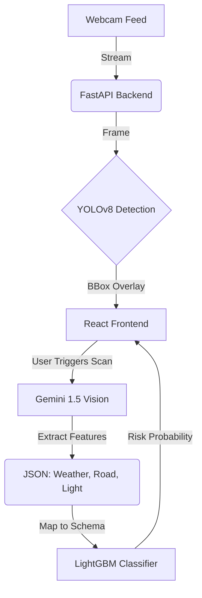

# 🚧 Neuro-Symbolic Real-Time Hazard Detection System

## 📋 Overview

This project implements a **Neuro-Symbolic AI architecture** for industrial safety monitoring. It combines the speed of real-time object detection (YOLOv8) with the reasoning capabilities of Multimodal Large Language Models (Google Gemini 1.5) and the statistical precision of Gradient Boosting (LightGBM).

Unlike standard "black box" AI, this system uses a hybrid approach:
1.  **Perception:** YOLOv8 detects objects in real-time.
2.  **Reasoning:** Gemini 1.5 analyzes the scene context (Weather, Road Type, Lighting) upon trigger.
3.  **Risk Calibration:** A pre-trained LightGBM classifier (trained on 55k+ Kaggle records) calculates a precise "Lethality Risk Score" based on the extracted features.

## 🚀 Key Features

* **Hybrid AI Pipeline:** seamlessly integrates Computer Vision, Generative AI, and Structured ML.
* **Real-Time Dashboard:** React + Vite frontend displaying live video feed and sub-200ms AI inference results.
* **Feature Extraction Agent:** Uses Gemini 1.5 Flash to convert unstructured video data into structured tabular data (JSON) compatible with classical ML models.
* **Legacy Model Integration:** Reuses a high-performance LightGBM model (Top 2% Global Rank) for risk scoring.

## 🏗️ Architecture

## 🛠️ Tech Stack
### Backend:
Python, FastAPI, Uvicorn

### Frontend:
React.js, Vite

### AI Models:

#### Vision:
YOLOv8 (Ultralytics)

#### LLM:
Google Gemini 1.5 Flash (via Google GenAI SDK)

#### Classifier: 
LightGBM (Scikit-Learn pipeline)

#### Tools:
OpenCV, Pandas, Joblib

### ⚡ Installation & Setup
#### Prerequisites
Node.js (v18+)

Python (v3.10+)

Google Gemini API Key

#### 1. Backend Setup

cd backend

#### Create virtual environment (Optional but recommended)
python -m venv venv
source venv/bin/activate  # On Windows: venv\Scripts\activate

#### Install Dependencies
pip install fastapi uvicorn python-multipart opencv-python ultralytics joblib pandas python-dotenv google-generativeai lightgbm scikit-learn

#### Configure Environment
Create a .env file inside /backend and add:
GOOGLE_API_KEY=your_actual_api_key_here

#### Run Server
python main.py
Server will start at http://localhost:8000

#### 2. Frontend Setup
Open a new terminal:

cd frontend

#### Install Node Modules
npm install

#### Start Dev Server
npm run dev
Dashboard will open at http://localhost:5173

### 🎮 Usage
Open the Dashboard in your browser.

You will see the live webcam feed with YOLO object detection boxes.

To Analyze Risk: Click the "SCAN HAZARD" button (or press 'S').

The system will capture the current frame, send it to Gemini for environmental analysis, and display the calculated Risk Score on the right panel.

### 🧠 Model Details
The Brain (LightGBM): The classifier was trained on the "Road Safety" dataset using a Stacking Ensemble approach. It achieves an F1-Score of 0.88 on the test set.

The Eyes (Gemini): We use a prompt-engineered VLM to map visual inputs (e.g., "It's raining heavily") to the exact categorical codes expected by the LightGBM model (e.g., Weather=1).

### 🔮 Future Improvements
#### Automated Trigger:
Replace manual button press with automated triggers when specific unsafe classes (e.g., 'Fire', 'Crash') are detected by YOLO.

#### Voice Alerts:
Integrate browser Text-to-Speech API to announce "Critical Risk" audibly.

#### Edge Deployment:
Optimize the pipeline to run on NVIDIA Jetson Nano.
